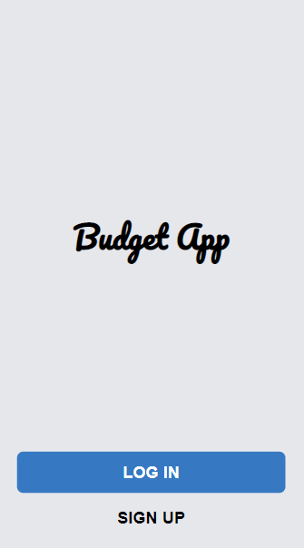

# Budget App

> The Budget app is a mobile web application where you can manage your budget: you have a list of payments associated with a category, so that you can see how much money you spent and on what.

## Live Demo

[Live Demo Link](https://gentle-savannah-35443.herokuapp.com/)

## ScreenShot

## Database Schema

## Built With

- Ruby
- Ruby on Rails
- Tailwind
- SQL Postgres

## Getting Started

To get a local copy up and running follow these simple example steps:

1- Click on the top right green **`code`** button. 
2- On the dropdown menu, choose the **`download zip`** button. 
3- After download, extract the zip file and you have the project running on your machine. 
4- You can also clone the project using the **`git clone`** command. 
5- Run the command `bundle install` to install all gems of the project. 
6- To run the server use command `rails s` and to see it go to your browser and use this link `http://127.0.0.1:3000/`. 

## Databases setup

To create the databases, please follow these simple example steps:

1- Run the command `rails db:create` to create the databases.
2- Run the command `rails db:migrate` to create the neccessary tables and relations.

## Tests

- If you want to run some unit tests, all you need to do is:
- On your terminal execute:
  > `gem install rspec`
- Run the `rspec` command in this case over the path of `spec/`, the resulting command will look like this:
  > `rspec spec/`

## Author

👤 **Shady Shawkat**

- GitHub: [@ShadyShawkat](https://github.com/ShadyShawkat)
- Twitter: [@ShadyShawkat3](https://twitter.com/ShadyShawkat3)
- LinkedIn: [Shady Shawkat](https://linkedin.com/in/Shady-Shawkat)

## 🤝 Contributing

Contributions, issues, and feature requests are welcome!
Feel free to check the [issues page](../../issues/).

## Show your support

Give a ⭐️ if you like this project!

## Acknowledgments

- Inspired by [Gregoire Vella](https://www.behance.net/gregoirevella)

## 📝 License

This project is [MIT](./MIT.md) licensed.